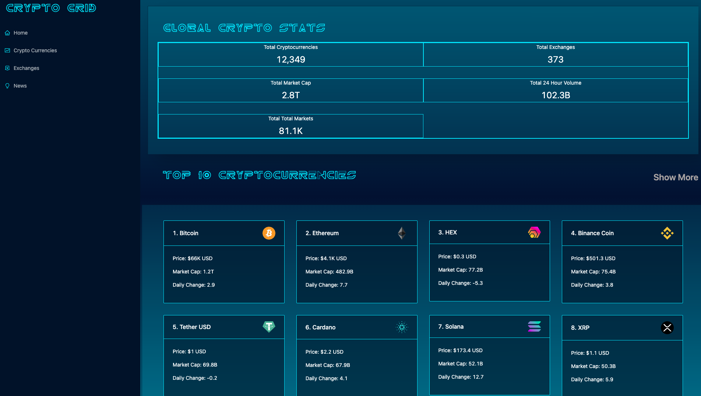

# The Crypto Grid

## General 

A Cryptocurrency application created with React and Redux Toolkit that keeps visitors up to date with all cryptocurrency news and details. Data is pulled from Rapid API (Coinranking / Bing News). Ant Design used for styled components.

## Table of Contents

- [Setup](#setup)
- [Technologies](#technologies)
- [Links](#links)
- [Contact](#contact)
- [Preview](#preview)

### Setup
To run locally: 
* Start by cloning the repo by using the commands:
* `$ git clone git@github.com:d-trecker/crypto-grid.git`
* From the root directory of the cloned repo, use the command `npm i` 
* Run `npm start` 

### Technologies
Created  with: 
* react: ^17.0.2
* react-dom: ^17.0.2
* react-redux: ^7.2.5
* react-router-dom: ^5.3.0
* @reduxjs/toolkit: ^1.6.1
* antd: ^4.16.13
* axios: ^0.21.4
* chart.js: ^3.5.1
* react-chartjs-2: ^3.0.5
* html-react-parser: ^1.3.0
* millify: ^4.0.0
* moment: ^2.29.1
* Rapid API: Coinranking/ Bing News
* Sass

### Links
Repo Link: https://github.com/d-trecker/crypto-grid.git  
Deployed Link: https://d-trecker.github.io/crypto-grid   

### Contact
Feel free to drop me a line @ [dylan.j.trecker@gmail.com](mailto:dylan.j.trecker@gmail.com?subject=[GitHub]%20Crypto%20Grid)

### Preview

